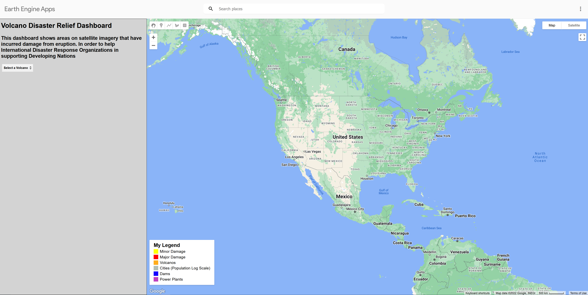

# VolcanoResponse

## Mission

To Improve the efficiency of disaster response resources for volcano eruptions in developing countries, using computer vision estimates based on recent satellite image data.

## Problem

Developing nations lack the same volcanic detection and monitoring infrastructure as developed nations that are important in preparing for eruptions. We aim to bridge this resource and knowledge gap by using computer vision and data science on satellite imagery to pinpoint which areas are likely to be damaged alongside damage severity estimates. International Disaster Response Organizations can utilize this knowledge to be better informed on what decisions to make and how to effectively utilize resources to protect communities and save lives.

## [Check Out the VolcanoResponse Dashboard Here](https://armds.users.earthengine.app/view/volcanoresponse)

Watch this [video](youtube.com) to learn how to use the dashboard.

### Team

Ren Tu             |  Jeffrey Adams        |  Mackenzie Lee      | Anne Marshall
:-------------------------:|:-------------------------: | :-------------------------: | :-------------------------:
 |   |  |  

MIDS Capstone Summer 2022
